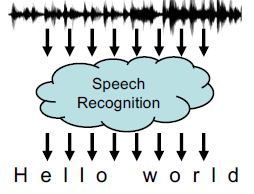

# Spoken Human Robot Interaction [SHRI]

Human-robot interaction is the field of study dedicated to understanding, designing, and evaluating robotic systems for use by or with humans. 

---

## Spoken Language Understanding (SLU)

### I. Interpreting commands

#### Basic Pipeline

1. Automatic Speech Recognition
    - Recognition and transcription of user utterances.
2. Morpho-Syntactic Analysis
    - Morphological information and syntactic structures.
3. Semantic Analysis
    - Extraction of meaning from sentences for grounding.

##### How to

1. Grammar Based
2. Data Driven

###### But, let us take about the differences

| Grammar-based                        | Data-driven                             |
| ------------------------------------ | --------------------------------------- |
| Hand-crafted grammar development     | Learning from data                      |
| Parsing                              | Statistical models rather than grammars |
| Limited coverage (structure+lexicon) | Generalization (structure+lexicon)      |
| High performance on specific domains | Over/Under-fitting risk                 |

###### Understanding tools

- Speaky 4 Robots (S4U)
  - A tool for generating spoken command interpretation
  - Grammar-based
  - Language is domain-specific
  - Interpretation is application-dependent

- Adaptive spoken Language Understanding 4 Robots (LU4R2)
  - A Spoken Language understanding tool for robotic commands
  - Data-driven
  - Language is domain-driven
  - Interpretation is context-sensitive

#### Automatic Speech Recognition [ASR]

It is simply the process of converting audio signals into text, also known as transcribing.

##### Burdens

There is never a free lunch, so what are the issues that we might encounter

1. Segmentation (Missing spaces)
2. Coarticulation (Merging sounds)
3. Homophones (different words that sound the same).
4. Not to mention that, input voice is highly noisy and that the natural language is naturally inherently ambiguous (highly dependent on the context).

##### Approaches

1. Classical [Hidden Markov Models (HMM)](https://github.com/elsheikh21/weather-inference-hmm/readme.md)
2. Deep Learning Connectionist Temporal Classification (CTC)

- Evaluation Metrics [Word Error Rate (WER)]

---

### II. Dialogic Interaction

- It improves by interacting with the user - by instructing the robot to fill in the gaps -
- Interactions require Spoken Dialog System (SDS)

| Command interpretation                             | Dialogic interactions                                                                 |
| -------------------------------------------------- | ------------------------------------------------------------------------------------- |
| Communication is an atomic processing of sentences | Communication is a sequence of turns (sentences)                                      |
| Each sentence is independent                       | Each sentence depends (at least) on the previous one                                  |
| Linguistic/Physical context irrelevant             | The dialogue state influences the flow                                                |
| The SLU process is enough to carry out the task    | Implies: dialogue manager, SLU, dialogue state tracking, natural language generation, |

#### Spoken Dialog Systems (SDS)

- SDS falls under the umbrella of Dialogue management
- SDSs are intelligent agents able to help users to finish tasks more efficiently through spoken interactions, added to, they are being integrated into various devices.
- Based on Dialogic interactions
  - From question-answering to dialog
  - Communication takes place in a sequence of turns
  - Each sentence depends (at least) on the previous one, in general the dialogue state influences the flow
  - Language in dialog is more “implicit” and unstructured
  - Disfluences can be relevant (including other sound features)
  - Text-To-Speech is required

##### Types of SDS

1. Conversational Agents
   - Personal Assistants
   - Help user to achieve manifold tasks
2. (Chit-chat agents) chatbots
   - User entertainers
   - No specific goal
   - Focus is on producing coherent responses
3. Task oriented SDSs
   - Personal Assistants
   - Help user to achieve a specific tasks

###### Task Oriented SDSs

Based on:

- Domain ontology: a characterization of the user intensions that can be dealt with
- Frames: structured representations of the semantics associated to each intension
- Slots (frame elements): containers for the values that need to be filled in to achieve the intension
  
---
